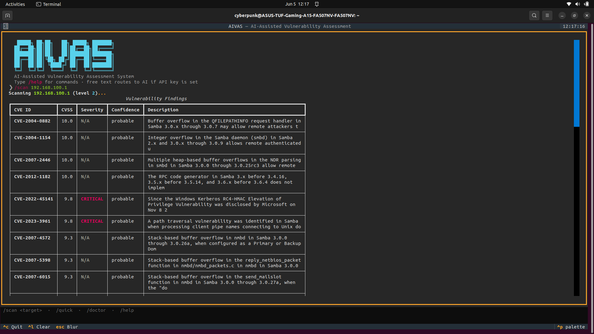

# AIVAS

**AI-Assisted Network Vulnerability Assessment System**

AIVAS is a free, offline-capable network vulnerability scanner for Linux. It combines Nmap service discovery, a local NIST NVD CVE database, active configuration probing, and optional AI-powered bilingual (English/Swahili) risk narration.



---

## Features

- CVE correlation against a local SQLite database synced from NIST NVD (200,000+ CVEs)
- CISA KEV flagging — marks CVEs actively exploited in the wild
- Level 1 active configuration probing: missing security headers, exposed endpoints, risky HTTP methods
- AI risk narration in English and Swahili via Groq or Ollama
- Interactive Textual TUI with slash commands and AI-routed free text input
- Scan history, HTML/PDF report export, and diff between scan sessions
- Fully offline after initial database sync

---

## Requirements

- Linux (Ubuntu 20.04+, Kali, Debian)
- Python 3.10 or later
- nmap (`sudo apt install nmap`)
- pip 23 or later

---

## Installation

```bash
pip install aivas
```

If `aivas` is not found after install, add the local bin directory to your PATH:

```bash
echo 'export PATH="$HOME/.local/bin:$PATH"' >> ~/.bashrc
source ~/.bashrc
```

### Install from source

```bash
git clone https://github.com/Baraka-Malila/aivas.git
cd aivas
python3 -m pip install --upgrade pip
python3 -m pip install -e ".[dev]"
```

---

## Quick Start

```bash
# Check your setup
aivas doctor

# Populate the CVE database (from local NVD JSON feeds)
aivas update-db --source /path/to/nvd-json-data-feeds/

# Or sync from the NVD API
aivas update-db

# Sync known exploited vulnerabilities
aivas update-kev

# Launch the interactive interface
aivas
```

---

## Usage

### Interactive TUI

Run `aivas` with no arguments to open the interface. Type `/help` for a full command list.

| Command | Description |
|---------|-------------|
| `/scan <target>` | Full CVE and config probe scan |
| `/quick <target>` | Fast service scan (level 1) |
| `/deep <target> [--udp]` | Full scan with UDP discovery |
| `/ask <query>` | Natural language scan routing (requires API key) |
| `/doctor` | Check dependencies and configuration |
| `/history list` | View past scan sessions |
| `/history show <id>` | Replay findings from a previous scan |
| `/kev` | Sync CISA Known Exploited Vulnerabilities |
| `/config set <key> <value>` | Save a configuration value |
| `/help` | List all commands |
| `/exit` | Quit |

Free text without a leading `/` is routed to the AI intent parser if an API key is configured. Without an API key, all core scanning features work without AI.

### Command line

```bash
aivas scan 192.168.1.1
aivas scan 192.168.1.1 --level 2 --save --report report.html
aivas scan 192.168.1.1 --narrate --api-key YOUR_KEY
sudo aivas scan 192.168.1.1 --udp
aivas search apache --version 2.4.52
aivas history list
aivas config set api_key YOUR_GROQ_KEY
```

---

## Scan Levels

| Level | What it does |
|-------|-------------|
| 1 | Service version detection only |
| 2 | CVE correlation + NSE vulnerability scripts + config probing (default) |
| 3 | Level 2 + SSH-authenticated installed package scan |

---

## Configuration

Settings are stored in `~/.aivas/config.yml`:

```yaml
api_key: your-groq-api-key
provider: groq        # groq or ollama
lang: both            # en, sw, or both
default_level: 2
```

Set any value:

```bash
aivas config set provider ollama
aivas config show
```

---

## Contributing

See [CONTRIBUTING.md](CONTRIBUTING.md) for development setup, coding standards, and how to submit changes.

---

## License

MIT. See [LICENSE](LICENSE).

AIVAS is intended for use on networks you own or have explicit authorisation to scan. Unauthorised scanning may be illegal in your jurisdiction.

---

## Authors

Baraka Malila and Michael Chacha Megewa  
Diploma in Computer Engineering, MUST (Mbeya University of Science and Technology), 2025/2026  
Supervisor: Namsembwa Mzava
